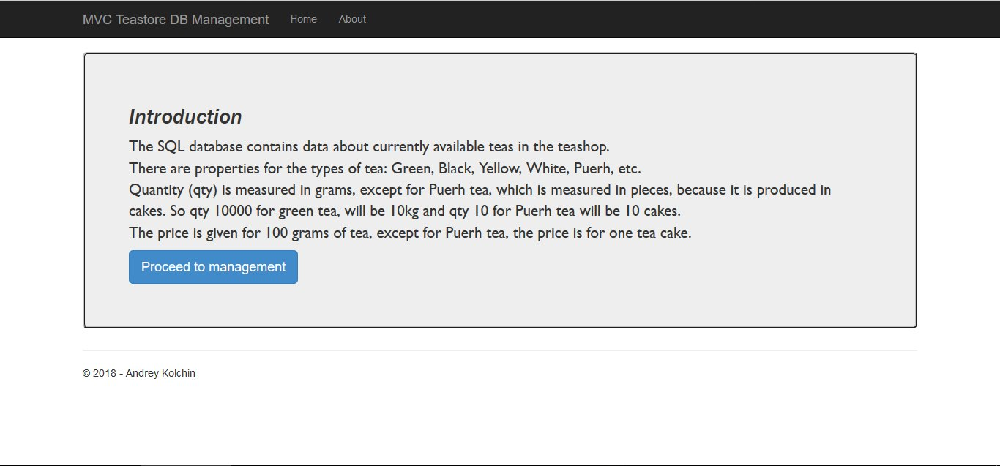
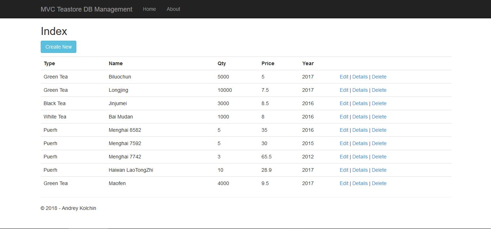
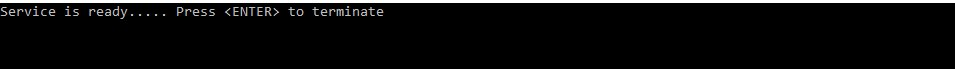
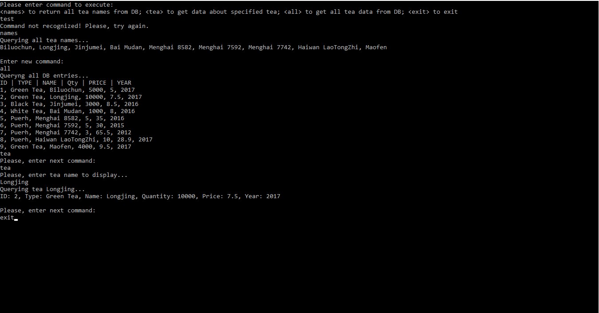
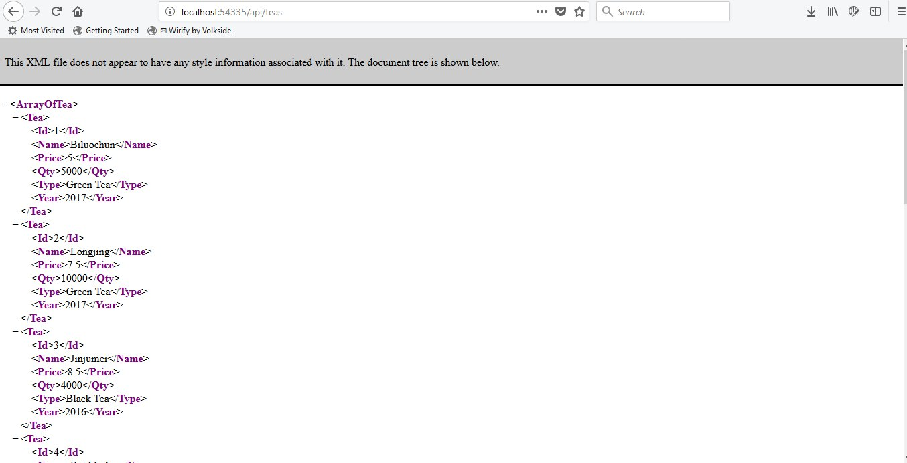
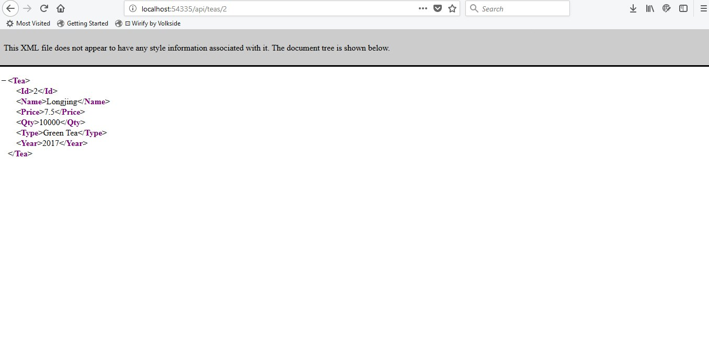
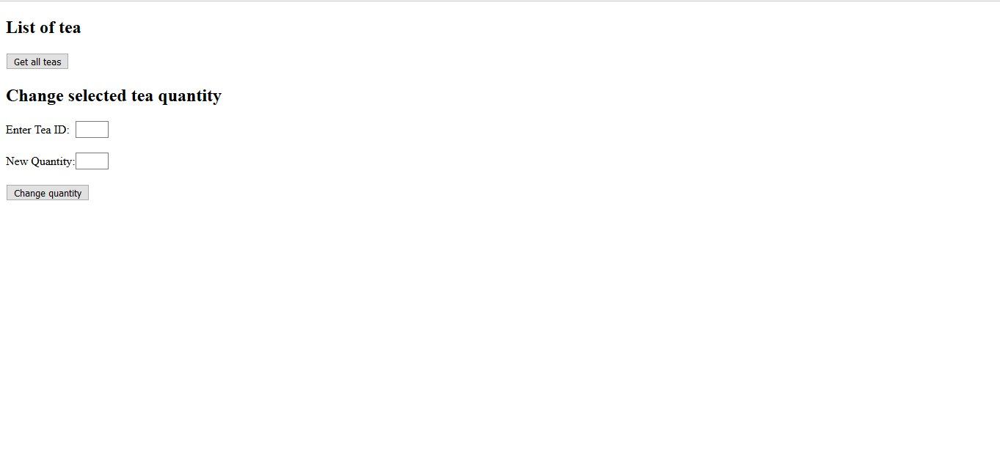
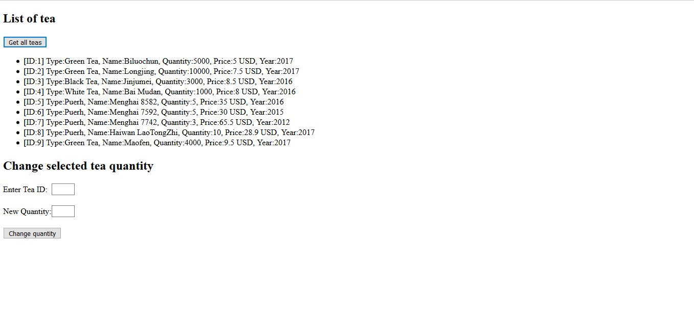
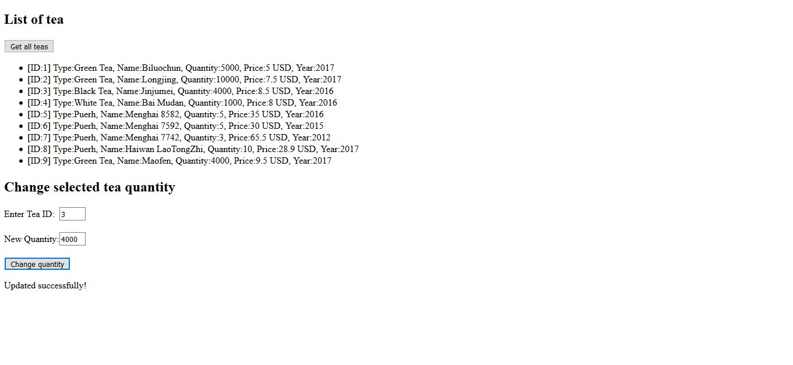

# Description
University assesment: Build an MVC5 Entity Framework application to manage data in the database,
then add a WCF Service and a client; and finally create a REST Service (WebAPI)

## Overview

Solution contains 4 projects:
1)ASP.NET MVC app to manage local SQL database. Initially that was Azure Database, but my trial version expired, so changed it
to local database
2)Console WCF Service
3)Console WCF Client
4)WebAPI Service

And 2 test projects:
1)CA2_AzureTests - contains tests for MVC application and Console WCF Service
2)WebAPIServiceTests

## Setup

You will have to update connection string with your path to local DB to function properly
* Example:  "connectionString="metadata=res://*/Models.TeaModel.csdl|res://*/Models.TeaModel.ssdl|res://*/Models.TeaModel.msl;provider=System.Data.SqlClient;provider connection string=&quot;data source=(LocalDB)\MSSQLLocalDB;attachdbfilename=**C:\DIT\Projects\GitHub\CA2\Teastore.mdf** (Update this path to yours);integrated security=True;connect timeout=30;MultipleActiveResultSets=True;App=EntityFramework&quot;" providerName="System.Data.EntityClient"

* If you want, you can create a database yourself

SQL Query for creating a table is saved in the 1st project file: Models/TeaModel.edmx/TeaModel.edmx.sql

-- Creating table 'Teas'

CREATE TABLE [dbo].[Teas] (

    [Id] int IDENTITY(1,1) NOT NULL,
    
    [Type] nvarchar(max)  NOT NULL,
    
    [Name] nvarchar(max)  NOT NULL,
    
    [Qty] smallint  NOT NULL,
    
    [Price] float  NOT NULL,
    
    [Year] nvarchar(max)  NOT NULL
    
);

GO

-- Creating primary key on [Id] in table 'Teas'

ALTER TABLE [dbo].[Teas]

ADD CONSTRAINT [PK_Teas]

    PRIMARY KEY CLUSTERED ([Id] ASC);
    
GO

The data which was added to table and used for project can be found in MockDB class in CA2_AzureTests

Here is example sql queries:

INSERT INTO Teas (Type, Name, Qty, Price, Year) VALUES ('Green Tea', 'Biluochun', 5000, 5, '2017');

INSERT INTO Teas (Type, Name, Qty, Price, Year) VALUES ('Green Tea', 'Longjing', 10000, 7.5, '2017');

INSERT INTO Teas (Type, Name, Qty, Price, Year) VALUES ('Black Tea', 'Jinjumei', 3000, 8.5, '2016');

INSERT INTO Teas (Type, Name, Qty, Price, Year) VALUES ('White Tea', 'Bai Mudan', 1000, 8, '2016');

INSERT INTO Teas (Type, Name, Qty, Price, Year) VALUES ('Puerh', 'Menghai 8582', 5, 35, '2016');

INSERT INTO Teas (Type, Name, Qty, Price, Year) VALUES ('Puerh', 'Menghai 7592', 5, 30, '2015');

INSERT INTO Teas (Type, Name, Qty, Price, Year) VALUES ('Puerh', 'Menghai 7742', 3, 65.5, '2012');

INSERT INTO Teas (Type, Name, Qty, Price, Year) VALUES ('Puerh', 'Haiwan LaoTongZhi', 10, 28.9, '2017');

INSERT INTO Teas (Type, Name, Qty, Price, Year) VALUES ('Green Tea', 'Maofen', 4000, 9.5, '2017');

## Built by
* Visual Studio 2015

## Screenshots

